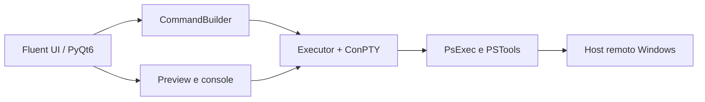

<p align="center">
  
</p>

<h1 align="center">RemoteOps 2.0.2 (Build 76)</h1>

<p align="center">
  <strong>Operações remotas no Windows via PsExec</strong><br />
  Instaladores, scripts, WinGet, inventário e desinstalação — interface Fluent, preview em tempo real e empacotamento portátil.
</p>

<p align="center">
  
</p>

<p align="center">
  
  
  
  
  
</p>

<p align="center">
  <a href="#instalação">Instalação</a> ·
  <a href="#uso-rápido">Uso rápido</a> ·
  <a href="#capacidades">Capacidades</a> ·
  <a href="#segurança-de-credenciais">Segurança</a> ·
  <a href="CHANGELOG.md">Changelog</a>
</p>

---

O comando executado é o que está selecionado na aba **PsExec**. A senha nunca aparece no preview nem nos logs (`-p ********`).

Identidade do produto: **`RemoteOps 2.0.2 (Build 76)`** — a mesma string da janela, definida em `remoteops.core.version` (`__version__` + `__build__`) e exposta em `remoteops.ui.branding.APP_DISPLAY_NAME`.

---

## Por que RemoteOps

|  |  |
|--|--|
| **Uma superfície, várias operações** | PsExec, MSI, PowerShell, CMD, Robocopy, WinGet, inventário, impressoras, sessões, contas locais e energia no mesmo workspace Fluent. |
| **O que você vê é o que roda** | Preview em tempo real a partir da UI. Sem flags ocultas de instalador: lote e execução única leem o estado atual do PsExec. |
| **Portátil de verdade** | `settings.ini`, `hosts.json` e `logs/` ao lado do exe (ou na raiz do repo em desenvolvimento). |
| **Credenciais com redação** | Senha injetada só na execução, mascarada no preview, nos logs e nos arquivos. |



---

## Capacidades

<table>
<tr>
<td width="50%">

**Entrega de software**
- `.exe`, `.msi`, `.ps1`, `.bat` ou pasta
- Instalação em lote por faixa de IP ou `hosts.json`
- WinGet remoto: listar, buscar, instalar, atualizar, desinstalar
- Pesquisa multi-host com desinstalação via `UninstallString`

</td>
<td width="50%">

**Operação do host**
- Inventário: PsInfo + aplicativos (Remote Registry)
- Processos, serviços e energia (PsList / PsKill / PsService / PsShutdown)
- Sessões e arquivos: PsLoggedOn, PsFile, Handle via PsExec
- Contas locais e rotação de senha com PsPasswd

</td>
</tr>
<tr>
<td width="50%">

**Rede e diagnóstico**
- Status ICMP + TCP 445 — **Executar** só com a 445 acessível
- Conectividade: ICMP Ping e TCP Ping (PsPing)
- Robocopy para `.msi` / `.ps1` / `.bat` / pasta; `.exe` usa `-c` do PsExec
- Impressoras: catálogo do servidor e instalação/conexão no host

</td>
<td width="50%">

**Experiência**
- Interface Fluent / PyQt6, tooltips em card
- Abas dinâmicas: só aparecem quando o tipo de arquivo pede
- Mensagem interativa na sessão do usuário remoto
- RustDesk: coleta o ID no remoto e abre `rustdesk.exe --connect <ID>`

</td>
</tr>
</table>

---

## Abas

A aba **PsExec** está sempre visível. As demais abrem sob demanda.

<details>
<summary><strong>Quando cada aba aparece</strong></summary>

| Aba | Quando aparece | Função |
|-----|----------------|--------|
| **PsExec** | Sempre | Host, autenticação, privilégios, flags e args do programa remoto |
| **Instalação em Lote** | Arquivo `.exe` | Varre a rede ou `hosts.json` e instala o EXE (versão desejada opcional) |
| **MSI** | Arquivo `.msi` | Ação, interface, reinício e propriedades do `msiexec` |
| **PowerShell** | `.ps1` ou comando `powershell` | `-Command`, `-File`, `-EncodedCommand`, política de execução |
| **CMD** | `.bat` ou comando `cmd` | `/C` ou `/K` (checkboxes exclusivos), `/D`, `/Q` e cadeia |
| **Robocopy** | Arquivo/pasta que não seja `.exe` | Destino em `C$` e switches da cópia |
| **PsInfo** | Botão na aba PsExec | Inventário remoto (host preenchido) |
| **Aplicativos** | Botão na aba PsExec | Lista instalados no host; desinstalação |
| **WinGet** | Botão na aba PsExec | `winget` remoto (host preenchido) |
| **Mensagem** | Botão na aba PsExec | Envia mensagem interativa ao usuário da sessão remota |
| **Impressoras** | Botão na aba PsExec | Lista o servidor de impressão e instala/conecta impressoras no host |
| **Processos** | Botão na aba PsExec | PsList / PsKill / PsSuspend no host remoto |
| **Serviços** | Botão na aba PsExec | PsService — consulta e controle de serviços |
| **Energia** | Botão na aba PsExec | PsShutdown — desligar, reiniciar, hibernar |
| **Sessões e Arquivos** | Botão na aba PsExec | PsLoggedOn + PsFile + Handle (via PsExec) |
| **Contas Locais** | Botão na aba PsExec | Contas locais (PowerShell remoto) + alteração de senha (PsPasswd) |
| **Pesquisa de Aplicativos** | Ícone de busca no cabeçalho | Multi-host (faixa de IP ou `hosts.json`) |
| **Configurações** | Ícone de engrenagem no cabeçalho | PSTools, Handle, RustDesk, logs, Remote Registry, faixa de IP, servidor de impressão |
| **Conectividade** | Botão Diagnosticar na linha de Status do PsExec | ICMP Ping e TCP Ping (PsPing); não duplica o console compartilhado |

</details>

---

## Requisitos

| Item | Observação |
|------|------------|
| **Sistema** | Windows 10 ou 11 |
| **Python** | 3.10+ (desenvolvimento) |
| **PyQt6** | Interface |
| **PSTools** | Pasta com PsExec e PsInfo (obrigatórios) e, opcionalmente, PsPing, PsList, PsService, PsShutdown, PsLoggedOn, PsFile, **PsPasswd** — padrão `C:\PSTools\` (ajustável em Configurações) |
| **Handle** | Opcional — pasta própria com `Handle64.exe` / `Handle.exe` (padrão `C:\Handle\`, ajustável em Configurações → Handle; download Sysinternals separado do PsTools) |
| **WinGet** | No host remoto, para a aba WinGet |
| **RustDesk** | Opcional, no host e na máquina local |
| **Rede** | Ping, SMB (`C$`) e Remote Registry conforme o fluxo |

Os binários Sysinternals **não** são empacotados no `RemoteOps.exe`.

---

## Instalação

```powershell
cd RemoteOps
python -m venv .venv
.venv\Scripts\activate
pip install -e ".[dev]"
# opcional — gerar ícones / empacotar:
pip install -e ".[build]"
```

Runtime mínimo:

```powershell
pip install PyQt6
```

---

## Uso rápido

```powershell
python main.py
# ou
python -m remoteops
```

1. Informe o **host remoto** na aba PsExec e aguarde o status de conectividade (TCP 445).
2. Autenticação só se a sessão atual não bastar (`-u` / `-p`).
3. Selecione um arquivo no cabeçalho, **ou** digite o comando remoto (ex.: `cmd`, `powershell`).
4. Ajuste as abas que surgirem e as flags do PsExec.
5. Confira o **preview** e clique em **Executar**. A saída vai para o console (ConPTY).

Duplo clique em uma célula de tabela copia o texto visível.

---

## Arquivo EXE

Ao escolher um `.exe`:

1. A aba **Instalação em Lote** aparece.
2. Na aba PsExec são **pré-marcados** `-accepteula`, `-nobanner`, `-s`, `-c` e `-f`.
3. Depois disso você pode marcar ou desmarcar qualquer opção; o comando segue a UI.
4. Não há lista oculta de flags de instalador — lote e execução única usam o estado atual do PsExec (o lote só troca o host de cada alvo).

Argumentos do instalador (`/S`, `/quiet`, …) vão em **Args do programa** na aba PsExec.

---

## Segurança de credenciais

Política em `remoteops.utils.redaction`:

- Preview, logs e arquivos usam texto sanitizado (`-p` isolada; não mascara `-Path` / `-Profile` / `-Priority`).
- O builder **não** guarda a senha — só sabe se há senha e mostra `-p ********`.
- A senha é lida na UI na hora de executar (`CredentialContext`), injetada no argv e descartada em seguida.
- Prefira a sessão Windows atual (sem `-u`/`-p`) quando possível.

### Contas Locais e PsPasswd

A aba **Contas Locais** (botão na aba PsExec) lista somente contas com `LocalAccount=True` via PowerShell remoto (`Get-CimInstance Win32_UserAccount`). Contas de domínio **não** aparecem nem podem ser alteradas.

- **Credencial administrativa** (`-u`/`-p` do PsExec/PsPasswd): usada apenas para conectar ao computador remoto.
- **Nova senha**: aplicada à conta local selecionada na tabela (nunca digitada livremente).
- **PsPasswd** (`PsPasswd64.exe` / `PsPasswd.exe`) é **opcional**: sem ele a listagem funciona, mas o botão de alterar senha fica desabilitado.
- O PsPasswd é executado **localmente** com destino `\\HOST` (nunca sem host — evita alterar a máquina administrativa).
- Preview/logs mascaram **as duas senhas** (administrativa após `-p` e nova senha como último argumento).
- A alteração de senha é feita **sempre no host atual** da aba PsExec.
- Para rotação recorrente com senhas diferentes por dispositivo, prefira **Windows LAPS** (não integrado nesta versão).

### Limitações

- Com `-u`/`-p`, a senha fica na command line do processo (limitação do PsExec).
- Strings Python não são zeroizadas criptograficamente.

---

## hosts.json e faixa de IP

**Lista de hosts** (Pesquisa e Lote, quando a faixa de IP está desligada):

1. Copie `hosts.example.json` → `hosts.json` (raiz do repo ou pasta do exe).
2. Edite com os nomes do seu ambiente.

`hosts.json` está no `.gitignore`. `hosts.example.json` permanece versionado (hosts fictícios).

**Faixa de IP** (Configurações): início/fim IPv4, octetos ignorados e threads de varredura. Com a faixa ativa, Lote e Pesquisa varrem a rede em vez de usar `hosts.json`.

---

## Logging

Preferência **Salvar log em arquivo** em Configurações:

- Pasta `logs\` na raiz do repo (dev) ou ao lado do `RemoteOps.exe`
- Arquivo: `logs\app.log` (via `logging.FileHandler`; uma única rota de escrita)
- Demais preferências em `settings.ini` (local, não versionado): pasta PSTools, pasta Handle, workers, timeout do Remote Registry, faixa de IP, servidor de impressão

---

## Testes

```powershell
python -m unittest discover -s tests -v
```

---

## Build

```powershell
pip install -e ".[build]"
python -m PyInstaller --noconfirm --clean RemoteOps.spec
```

Ou `build.bat` na raiz do repositório. Gera `dist/RemoteOps.exe` (sem console) e copia `dist/config/` (`ApplicationCatalog.json`). Assets e templates WinGet entram no exe. **Não** empacota `hosts.json`, `settings.ini`, credenciais nem logs.

---

## Estrutura do projeto

```
RemoteOps/
├── main.py                      # entry point
├── remoteops/
│   ├── bootstrap.py             # QApplication, Fluent, MainWindow
│   ├── paths.py                 # caminhos portáteis (dev / exe)
│   ├── core/                    # builder, executor, ConPTY, versão
│   ├── services/                # execução, lote, impressoras, messaging, RustDesk
│   ├── ui/                      # janela, abas, widgets, estilo Fluent
│   ├── utils/                   # settings, hosts, catálogo, rede, redação
│   └── winget/                  # backend WinGet remoto
├── assets/
├── config/
├── hosts.example.json
├── RemoteOps.spec
└── pyproject.toml
```

---

<p align="center">
  <sub>RemoteOps 2.0.2 (Build 76) · Windows 10 / 11 · PyQt6 Fluent</sub>
</p>
